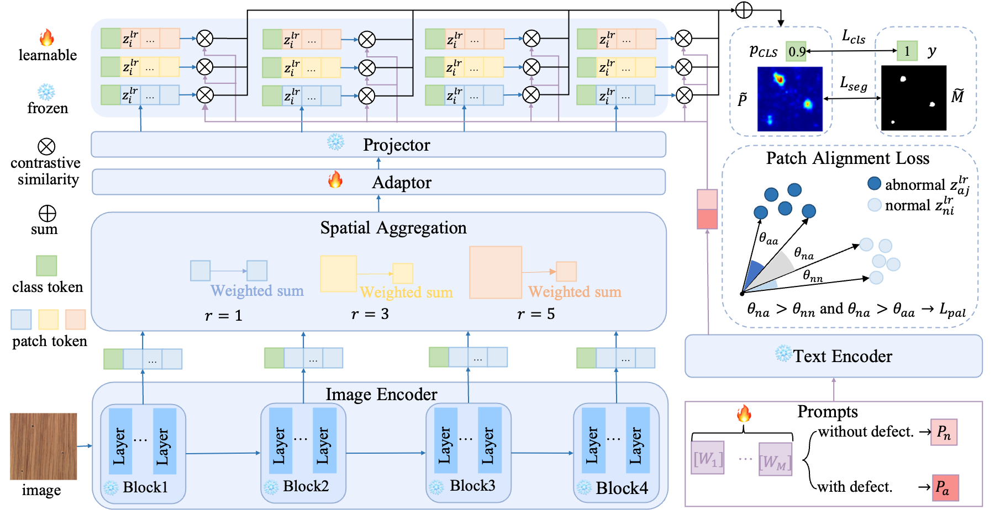

# LA-CLIP: Zero-Shot Anomaly Detection via Anomaly-Focused CLIP Adaptation

[](https://github.com/faith1220/LA-CLIP)
[](https://pytorch.org/)

Official implementation of **LA-CLIP** (also known as **AF-CLIP** in the paper), a novel framework for Zero-Shot Anomaly Detection that adapts CLIP through Anomaly-Focused mechanisms.



## 🌟 Key Features

- **Anomaly-Focused Adaptation**: Specifically designed for capturing subtle anomalous features in zero-shot scenarios.
- **LSAR (Layer-wise Semantic Alignment Residuals)**: Enhances multi-scale feature alignment for better anomaly localization.
- **MAPB (Memory-Augmented Prototype Bank)**: Provides robust feature references for robust anomaly scoring.
- **Cross-Domain Generalization**: State-of-the-art performance across multiple industrial and medical datasets.

## 🛠️ Installation

```bash
# Clone the repository
git clone https://github.com/faith1220/LA-CLIP.git
cd LA-CLIP

# Install dependencies (Example)
pip install torch torchvision tqdm numpy Pillow
```

## 📊 Dataset Preparation

Organize your datasets as follows. The project supports **MVTec AD**, **VisA**, and several medical datasets (**Br35H**, **BrainMRI**, etc.).

```text
/your/data/path/
├── mvtec
│   ├── bottle
│   │   ├── train
│   │   ├── test
│   │   └── ground_truth
│   └── ...
├── visa
│   ├── candle
│   └── ...
├── Br35H
├── BrainMRI
└── ...
```

## 🚀 Getting Started

### Training

To train the model on a specific dataset (e.g., MVTec):

```bash
# Edit data_dir in train.sh
sh ./train.sh
```

### Testing

To evaluate the pre-trained model:

```bash
# Edit data_dir and weight path in test.sh
sh ./test.sh
```

## 📈 Performance

LA-CLIP demonstrates superior performance on the following benchmarks:
- **Industrial**: MVTec AD, VisA, BTAD, DAGM, DTD-Synthetic.
- **Medical**: Br35H, BrainMRI, CVC-ClinicDB, CVC-ColonDB, ISIC, Kvasir.

## 📝 Citation

If you find this work useful, please consider citing:

```bibtex
@inproceedings{afclip2024,
  title={AF-CLIP: Zero-Shot Anomaly Detection via Anomaly-Focused CLIP Adaptation},
  author={...},
  booktitle={...},
  year={2024}
}
```

## 📧 Contact
For any questions, please contact [faith1220](https://github.com/faith1220).
